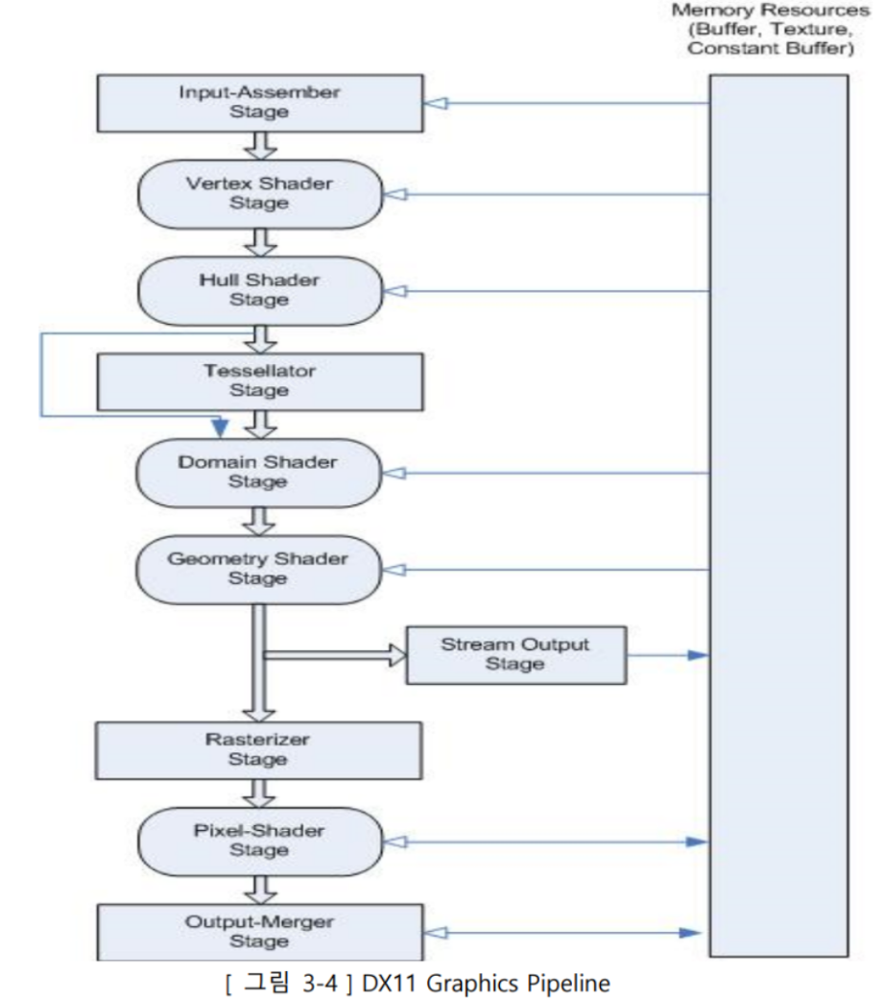
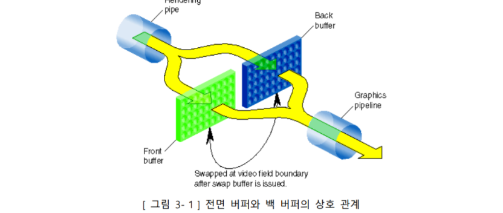

## OT
CPU와 GPU 차이 : 둘다 똑같이 연산을 하지만, CPU는 일반적인 연산을 하고, GPU는 병렬적인 연산을 한다.  
CPU는 순차적이고 복잡한 알고리즘을 사용시 유용하지만 GPU는 병렬적이고 단순한 알고리즘을 사용시 유용하다.
  

## 랜더링 파이프 라인 
3차원으로 만들어진 모델을 2차원에 투영하는 렌더링 과정의 프로세스를 자세하게 표현한 것이다.  
컴퓨터에 데이터로 존재하는 3D 리소스가 모니터에 출력되는 과정이 렌더링 파이프라인을 따르게 된다.

위 사진에서 사각형은 고정 프로그램 단계로 응용 프로그램에서 제어할 수 없는 단계이고,  
원은 프로그래밍 가능 단계로 응용 프로그램에서 제어할 수 있는 단계이다.

### Input-Assembler 
응용 프로그램(CPU)에서 정점 버퍼에 랜더링을 수행할 도형의 정점 데이터(프리미티브 데이터)를   
정점 버퍼에 담아 GPU에 전달하면 GPU에서 다른 파이프라인 단계에서 사용할 프리미티브로 조립하는 단계

### Vertex Shader
IA 단계에서 출력되는 Primitive의 각 정점에 대한 연산을 수행하는 단계로 모든 정점에 대해 한번씩 호출되며  
변환, 조명, 스키닝등 다양한 작업을 수행할 수 있으며 GPU 메모리에 저장된 다른 데이터에도 접근이 가능하다.

### Hull Shader
테셀레이션 작업의 시작이 되는 쉐이더로 폴리곤을 어떻게, 얼마나 분할할지를 결정하는 쉐이더이다.  
Hull Shader는 두 가지 작업을 동시에 수행하는데 첫 번째는 들어오는 제어점(낮은 차수)으로 제어점(높은 차수)을 생성하는 것이고,  
두 번째는 Patch Constant Data(???)를 계산하는 작업이다.
(Tesellation을 수행하는 경우 Vertex Shader는 World 변환까지만 수행한다.)

### Tessellator
주어진 모델의 정점을 더 잘게 쪼개어 디테일하게 표현할 때 사용하는 단계이다.  
Tessellator를 사용하면 다음과 같은 일이 가능하다.
* LOD 구현
* Low-Poly 모델을 High-Poly 모델로 변환
* 애니메이션, 물리 처리 등의 연산을 Low-Poly 모델에서 수행하고 High-Poly 모델로 렌더링

### Domain Shader
Tessellator의 결과와 Hull Shader단계에서의 결과인 패치 데이터가 입력으로 들어오며  
최종 Vertex를 생성하여 Projection 변환과 Displacement Mapping(높이 매핑)을 수행하는 단계이다.

### Geometry Shader
Vertex Shader에서 출력된 정점 데이터를 받아서 도형의 정점 데이터를 생성, 삭제하는 단계이다.  
Geometry Shader로 정보를 생성해 표현이 가능한 모델이면 정보를 빼고 저장하여 저장이 가능하니  
메모리를 절약할 수 있으며 Tessellation으로 생성된 정점을 표현할 때도 사용된다.

      Geometry Shader와 Tessellation은 비슷하지만 
      Geometry Shader는 정점을 생성하거나 제거하는 것이 주 목적이고 
      Tessellation은 기존의 정점을 분할하는 것이 주 목적이다.

### Stream Output
Geometry Shader의 출력을 버퍼 리소스에 쓸 수 있게 해주는 단계  
데이터가 버퍼에 쓰여지면 다시 Vertex Buffer로 설정하여 다음 렌더링 단계에서 사용할 수도 있으며  
CPU의 계산 결과를 읽어들이는 것도 가능하다.  
Geometry Shader에 한점을 전달한 뒤 점을 추가하고 이 결과를 Stream Output으로 전달하여 반복적으로 점을 추가하는 것이 가능하다.(파티클 시스템)

### Rasterizer
정점 정보가 결정된 도형을 픽셀로 변환하는 단계이다.  
이때 정점 사이의 공간은 보간을 통해 계산하여 픽셀로 변환된다.

### Pixel Shader
각 픽셀에 대한 연산을 수행하는 단계로 Vertex Shader와 마찬가지로 GPU 메모리에 저장된 다른 데이터에도 접근이 가능하다.  
이 단계에서는 텍스쳐 매핑, 조명, 쉐도우 맵 등의 작업을 수행한다.

### Output-Merger
픽셀 셰이더의 결과를 렌더 타겟에 쓰는 단계이다.  
이 단계에서 일부 픽셀들이 깊이 판정이나 스텐실 판정에 의해 건너뛰어질 수 있다.

  

## 장치 초기화
* Com(Componet Object Model) : DirectX의 프로그래밍 언어 독립성과 하위 호환성을 가능하게 하는 기술  
  
* Com 객체 : Com 인터페이스라고도 불리며 직접 생생하는것이 아니라 생성을 위한 별도의 API함수를 호출하여 생성한다.  
  
* DXGI : 그래픽스 런타임에 독립적은 저수준(low-level)작업들을 관리하는 것 DirectX의 그래픽스 기능이나  
어플리케이션으로부터 오는 표시를 받아 커널모드 드라이버나 하드웨어와 주고받는 역할을 한다.

* ID3D11Device : GPU와 GPU자원의 Virtual Representation을 제공  
  (기능 지원 점검과 자원할당에 사용)

* ID3D11DeviceContext : 파이프라인에 대한 그래픽처리
  (렌더 대상을 설정하고, 자원을 그래픽 파이프 라인에 묶고, GPU가 수행할 렌더링 명령들을 지시하는 데 사용.)

  

## SwapChain
하나의 프레임 버퍼로 화면을 표현한다면 화면 깜빡임(Flickering), 끊김(Tearing)이 발생한다.  
이러한 현상을 방지하고자 2개의 프래임 버퍼를 사용하는데 이를 더블 버퍼링(Double Buffering)이라고 한다.  
DirectX에서는 2개의 버퍼간의 역할을 교환하여 페이지가 전환되게 하는 것을 프레젠팅이라고 부르며 플리핑 방식으로 구현된다.  
플리핑을 위해서는 Direct X에서는 전면,후면 버퍼 사이에 SwapChain을 형성하고 있다.  

* SwapChain : 순차적으로 연결된 프레임 버퍼들의 집합
* 플리핑 : 전면/후면 버퍼의 포인터를 서로 맞바꾸는 것

  

## Depth Stencil
다이렉트는 WinAPI와는 다르게 3D 기반으로, winApi처럼 단순히 렌더링 순서로 물체를 그리지 않고,  
물체의 깊이를 판단하여 화면으로의 깊이가 낮은 픽셀이 앞으로 튀어나오고  
깊이가 깊은 픽셀 앞에 낮은 깊이의 물체가 있다면 가려지게 그려지는 식으로 렌더링된다.  
따라서 단순히 물체를 렌더링하기 위한 Render Target Texture 말고도, 프레임마다 물체의 깊이를 기록할 버퍼를 하나 더 가져야한다.

스텐실 버퍼(stencil buffer) : 특정 픽셀이 그려질지 여부를 결정하는데 사용되는 버퍼로    
back, depth 버퍼와 해상도가 같으며 특정 픽셀 단편들이 후면 버퍼에 기록되지 못하도록 하는데 사용된다.  

 
Depth Buffer : 가장 가까운 보여지는 정점의 깊이 정보를 저장하는 2차원 텍스처로
모든 깊이 정보를 저장하여,  
깊이 값을 비교해 후면 버퍼에 기록되지 못하도록(Draw하지 못하도록) 하는데 사용된다.

  

## ContantBuffer
* 정점 및 픽셀 쉐이더에서 사용할 수 있는 상수 데이터를 저장하는 버퍼이다.
* 상수 버퍼는 갱신 시 모든 변수를 갱신하게 되는데, 이는 비효율적이다. 불필요한 갱신을 줄이기 위해서는  
  변수들을 갱신 빈도에 따라서 나누어 만드는 것이 효율적이다.

  

## ResterizerState, SmapleState, BlendState
* Resterizer State : geometry shader로부터 출력된 프리미티브 데이터는 resterizer stage로 보내져  
  resterizer에 의해 렌더링 할 픽셀(텍셀)단위로 분해된다.

* Sample State : UV좌표가 0~1 범위를 벗어나는 경우 픽셀의 처리 방식을 지정하는 state이다.

* Blend State : 렌더링 파이프라인에서 픽셀 셰이더를 거쳐 생성된 값이 렌더 타겟에 어떻게 적용될지 결정하는 상태값