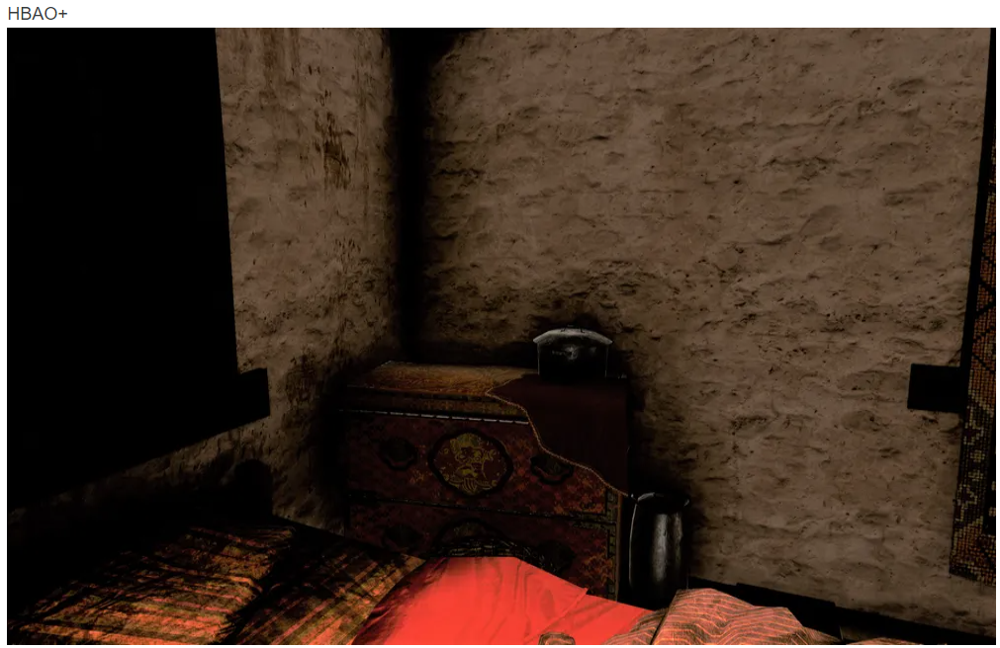

## Anti-Aliasing
오브젝트의 윤곽선이나 경계면에 나타나는 계단 현상을 줄이는 기법으로  
오브젝트의 경계면을 부드럽게 처리하여 자연스러운 그림을 만들어 준다.  

기본적인 원리는 인접한 픽셀들의 색상을 평균화하여 경계면을 부드럽게 처리하는 것이다.  
하지만 이러한 방식은 경계면이 부드러워지는 대신에 흐릿한 느낌을 줄 수 있다.  
Anti-Aliasing은 계단 현상을 줄이는 것이 목적이지 완전히 없애는 것은 아니며 부하가 많이 걸리는 기법이다.  

  

## Compute Shader(gpgpu)
고성능의 GPU 병렬 처리를 그래픽스 렌더링 이외의도 사용할 수 있게 해주는 기술로  
렌더링 파이프라인과 별개로 수행되며 병렬 처리를 위한 프로그래밍 모델을 제공한다.  
Compute Shader는 병렬 처리에 특화된 알고리즘에 유용하며 순차적으로 처리해야하는 알고리즘에는 적합하지 않다.

### 스레드와 스레드 그룹
GPU 프로그래밍에서, 실행에 필요한 스레드의 수는 스레드 그룹(thread groups)의 그리드로 나누어진다.  
스레드 그룹은 각각의 멀티프로세서에서 실행된다.  
예를 들어 16개의 멀티프로세서가 있다면, 16개의 스레드 그룹으로 분리하여 처리할 수 있다.  
또한 성능 향상을 위해서 하나의 멀티프로세서에서 2개 이상의 스레드 그룹을 처리하게 할 수 있다.  
각 스레드 그룹 내의 스레드끼리는 메모리를 공유해서 접근한다.  
스레드 동기화 작업도 각 스레드 그룹 내에서 일어난다.  
 
스레드 그룹은 n개의 스레드로 이루어진다.  
하드웨어는 스레드들을 warp로 나누며, warp마다 32개의 스레드 (NVIDIA 기준)가 있다(ATI는 64개; warpfront size).  
하나의 warp는 SIMD32에서 처리되는데, 32개의 스레드에 대해 명령어가 동시에 실행되는 것이다.  
따라서 성능을 위해 스레드 그룹의 사이즈 항상 warp size (32)의 배수인 것이 좋다.  
또한 warpfront size를 사용하면 두 종류의 GPU를 모두 만족시킬 수 있으므로 권장된다.  

### 스레드 식별 System Value
1. 각 스레드 그룹은 ID가 할당되어있다. SV_GroupID
2. 스레드 그룹 안의 각 스레드들은 각 그룹에서의 고유한 ID가 있다.  
    SV_GroupThreadID 스레드 로컬 저장 메모리로 indexing하는 데 유용함
3. Dispatch call : 스레드 그룹의 그리드를 발신. dispath thread ID는 dispatch call에 의해 생성된  
   모든 스레드들 사이에서 고유한 식별자이다. group ID와 group thread ID를 가지고 정해짐. SV_DispatchThreadID
4. group thread ID의 선형 인덱스 버전. SV_GroupIndex
   

한 Group의 Thread는 1024개로 제한되어 있다.

  

## CubeMap(환경 매핑)
물체에 비친 주변 환경을 물체의 표면에 나타내는 것으로 일반적으로 6면체 큐브 텍스처를 사용하는 방식과  
1장의 텍스처를 사용하는 구형 환경 매핑 방식이 있다.  

### Static CubeMap
미리 생성된 CubeMap을 사용하는 방식으로 물체의 위치에 따라 CubeMap이 변하지 않는다.

### Dynamic CubeMap
물체의 위치에 따라 CubeMap이 변하는 방식으로 물체의 위치에 따라 CubeMap을 다시 생성해야 한다.  
이때 필요한 기술이 MRT(Multiple Render Target)이며 텍스처의 생성 방식에 따라 다음과 같이 구분된다.

1) 다수의 텍스처 생성 및 각 텍스처를 지정하여 출력하는 방법
2) 1장의 텍스처 배열을 생성하여 각 배열의 인덱스를 지정하여 출력하는 방법
3) 큐브맵을 생성하여 각 면을 지정하여 출력하는 방법
   
  

## Terrain

* HeightMap  
  낮은 고도는 어두운 값, 높은 고도는 밝은 값으로 표현되는  
  그레이 스케일 이미지 파일을 불러와 각 픽셀의 색 정보를 지형의 높이로 사용하는 것.

* LOD(Level Of Detail)  
멀리 있는 물체를 표현할때 정점의 수를 줄여서 표현하는 기법으로 2가지 방법이 있다.

    * Static LOD  
        처음부터 메시의 정밀도가 정해져있고,  
        이를 카메라와의 거리에 따라서 단계별로 바꿔치기 해가며 출력한다.  
        연산이 간단하기 때문에 속도가 빠르지만, 여러단계의 메시를 추가적으로 가지고 있어야 하기 때문에  
        메모리의 낭비가 심하고, 거리에 따라서 메시의 단계가 급격하게 변하기 때문에 튐현상이 발생할 수도 있다.

    * Dynamic LOD  
        카메라와 물체의 거리에 따라서 실시간으로 메시의 정밀도를 변화시키는 기법.  
        이 방법은 여러가지 기법으로 분류되는데 일반적으로 메시 분할과 메시간략화 기법으로 나뉜다.  
        거리에 따라서 자연스럽게 LOD가 이루어지기 때문에 튐현상이 발생하지 않고, 낭비되는 메모리도 없다.  
        그러나 메시 분할이나 간략화에 추가적인 연산이 필요하기 때문에 상대적으로 속도가 느리다.

* Splatting  
    서페이스 상의 텍스처들을 알파맵을 사용하여 블렌딩하는 방식으로 Terrain 렌더링에 사용된다.

  

## Shadow
그림자을 구현하는 방법은 매우 다양하며 문제점을 극복하기 위해서  
오늘날 까지 지속적으로 기술이 발전되고 있다.  
먼저 그림자를 구현하는 대표적인 기술들은 다음과 같다.

### Planar Shadow
가장 기본적인 그림자 구현 기법으로 그림자가 투영되는 면이 평면이여야 하는 단점이 있지만.  
구현이 간단하고 빠르다는 장점이 있다.

### Projection Shadow
투영되는 면이 평면이 아닌 다른 형태의 면이여도 그림자를 투영할 수 있는 기법으로  
카메라 위치에 라이트를 배치하고 오브젝트를 바라보는 장면을  
빈 텍스처에 렌더링한 뒤 그 텍스처 평면에 매핑하여 그림자를 구현한다.  

  
카메라 위치에 라이트를 배치하고 오브젝트를 바라보는 장면을 렌더링하는 방식은  
DepthMap Shadow와 Volume Shadow에서도 사용되며 그림자를 구현하는 기초가 된다.

### DepthMap Shadow
깊이값 만을 저장하는 텍스처(버퍼)를 오브젝트 랜더링 전에 생성한 뒤 오브젝트를 랜더링 할 때  
깊이맵을 사용해 픽셀이 그림자가 되어야 할지를 판정하여 그림자를 구현하는 방법이다.  

DepthMap Shadow는 두번의 랜더링이 필요하지만 Self Shadow를 구현이 가능하다.

DepthMap Shadow에 사용할 깊이맵을 생성 시 라이트 방향에서 보는 장면을 깊이를 사용하기 때문에  
기울어진 깊이 텍스처가 생성되기 때문에 그림자 여드름 현상이 발생할 수 있다.  
이를 완화하기 위해 적절한 깊이 바이어스 값을 세팅해야 한다.

  

## Ambient Occlusion(주변광 차폐)
물체에 대한 빛의 차단 정도를 계산하여 빛의 감쇠 정도를 결정하는 기법

* 기본 개념  
  ambient occlusion의 핵심은，표면의 한 점p가 받는 간접광의 양은  
  그 점p를 중심으로 한 반구로 들어오는 빛(입사광)이 가려지는(차폐) 정도에 비례한다는 것이다.  
  점 p의 차폐도(가려진 정도)를 추정하는 한 가지 방법이 반직선 투사(ray casting, 또는 광선 투사)이다.  
  이 방법에서는 P 중심의 반구 전반에 무작위로 반직선을 쏘아서 주변의 메시 기하구조와의 교차를 판정한다

차폐도를 검사 시 다른 모든 삼각형과 검사를 수행하는데 이는 매우 비효율적이다.  
예제에서는 Octree를 사용해 검사할 삼각형을 선별하여 검사를 수행해 효율을 높였지만  
여전이 실시간으로 사용하기에는 부담이 커 일반적으로는 SSAO를 사용한다.

* SSAO(Screen Space Ambient Occlusion)  
  화면에 보이는 픽셀들만을 대상으로 Ambient Occlusion을 계산하는 기법으로  
  픽셀들의 noraml, depth를 이용해 주변 픽셀과 비교하여 차폐도를 계산한다.  
  현제는 HBAO+를 많이 사용하지만 HBAO보다 더 빠르기 때문에 지원하는 게임이 많다.  

  

## 22 모의 면접
    벡터 : 간단한 개념, 외적, 내적
    direct x : 스왑 체인 관련 지식
    렌더링 파이프 라인 : 각 단계에 대한 지식(포괄적으로 알고 있어야함)
    좌표변환, view space, index 버퍼 사용이유 등등 
    조명 : ambient(ambient occlusion), diffuse, specular 설명
    텍스처 : uv 좌표
    depth stencil : 그림자 원리, 깊이 관련 설명 (기술 소개서와 연관 지어서 나올 수 있음)
    기하 셰이더 : 간단한 설명
    컴퓨트 셰이더 : 간단한 설명(파이프 라인과 별개로 수행)
    테셀레이션 : 간단한 설명
    인스턴싱 : 개념, 사용하는 이유, 조건
    컬링 : 개념, 사용하는 이유, 조건
    피킹 : 개념, 사용하는 이유, 조건
    노말 매핑 : 필요성, 탄젠트 스페이스 사용하는 이유, 개념
    디스플레이스 매핑 : 필요성, 개념
    파티클 시스템 : 개념, 사용하는 이유, 스트림 아웃풋 스테이지, 지오메트리 셰이더
    엠비언트 오클루전 : 개념, 사용하는 이유, ssao
    애니메이션 : 개념, 사용하는 이유, 스키닝 애니메이션