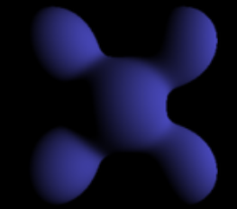
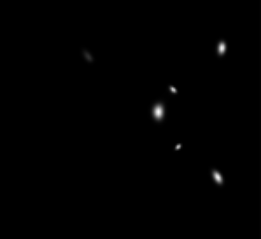
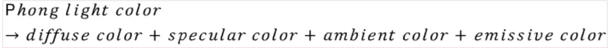
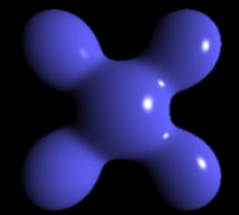
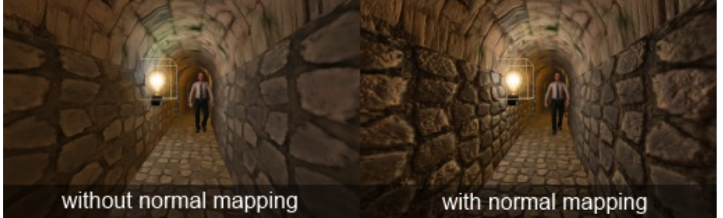
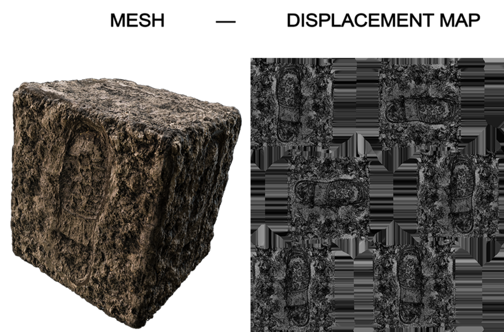

## Ambient Light(환경광)
물체가 기본적으로 받게되는 광원으로 주변광이라고도 한다.  
실제로 다른 물체에서 반사되는 빛을 연산하는 것은 큰 비용이 들기 때문에 이를 대신해서  
모든 물체에 균일한 빛을 주어 물체가 보이지 않는 상황을 방지한다.

  

## Diffuse Light(난반사광, 분산광)
특정한 방향으로 진행하며, 표면에 충돌한 빛이 모든 방향으로 반사되는 것을 말한다.  
모든 방향으로 동일하게 반사되므로 관찰자의 위치에 관계없이 빛의 방향과 표면만 고려하면 되며  
분산되어 흩어지는 값은 람베르트 코사인 법칙에 따라 결정된다.

  

## Specular Light(반사광)
하이라이트 효과를 주는 광원으로 빛의 반사 방향과 관찰자의 위치에 따라 결정된다.  
물체의 표면에서 반사되는 빛과 관찰자의 위치를 이용해 하이라이트 되는 정도를 계산한다.

  

## Emissive Light(발산광)
순수하게 Material의 색상만 표현하는 광원으로 물체의 표면에서 반사되는 빛이 아닌  
물체 자체에서 발산되는 빛을 표현한다.

  

## Pong 조명 모델

4가지 광원을 모두 사용하는 조명 모델로 각 광원의 영향력을 모두 더한 후 최종적으로 물체의 색상을 결정하며  
픽셀 쉐이더에서 수행한다.

  

## Normal Mapping
텍스처에 노말을 저장하여 조명 계산시 정점 노말 대신 텍스처의 픽셀의 노말을 사용하는 기법으로  
Low-Poly 모델이 High-Poly 모델처럼 보이게 하는 기법이다.  
노말 텍스처의 노말을 이용해 평평한 면이 굴곡이 있는 것처럼 보이게 하여 물체의 표면을 부드럽게 표현한다.  
단 이 방식은 굴곡이 있는것 처럼 보이게 하는 것이지 실제로 물체의 형태를 바꾸는 것은 아니다.  

* ### Tangent-space
정점에 접하는 평면을 Tangent-space라고 하며 노말 매핑을 위해서는 Tangent-space를 구해야 한다.  
* Tangent-Space는 기본 기하학에 독립적이므로 메시가 변형되거나 애니메이션되어도 정상적으로  
normal vector를 계산할 수 있다. 
* T, B, N 으로 구성되며 각각 Tangent, Binormal, Normal을 의미한다.
* 노말맵이 파란 이유는 x,y,z를 -1~1로 표현하는데 텍스처는 0~1의 값을 가지기 때문이다.  
  즉 x,y,z를 0~1로 표현해야 하므로 0.5를 더해주는데 z(normal)은 보통 0이상의 값이므로  
  (0, 0, 0.5)로 시작되어 노말맵은 보통 파란색을 띄게 된다. 

  

## Displacement Mapping
normal mapping과 비슷하지만 노말을 이용해 물체의 표면을 굴곡지게 하는 것이 아니라  
높이값을 이용해 실제로 물체의 표면을 울퉁불퉁하게 만드는 기법이다.

Tessellation을 이용해 물체의 정점을 분할하여 높이 맵을 이용해 물체의 표면을 실제로 변형한다.

