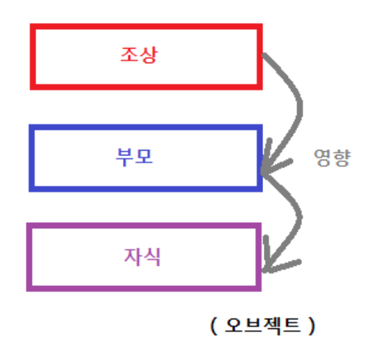

## 계층 구조

물체들이 부모-자식 관계를 갖는 것으로  
조상 오브젝트의 변환이 부모, 자식에게 영향을 준다.

## 애니메이션
* 정점 애니메이션  
  각 정점의 애니메이션 된 위치를 매 프레임마다 저장하고있다가 보간하여 출력하는 방식  
  원리와 구성이 간단하지만 정점의 수가 많아질수록 메모리를 많이 차지하게 된다.

* 계층적 애니메이션
  캐릭터를 여러개의 메시로 나누어 각 메시를 부모-자식 관계로 연결하여 구성하고  
  메시마다 애니메이션 행렬를 저장하여 사용하는 방식.(관절 사이가 부드럽지 않다.)

* Skeletal Animation  
  계층적 애니메이션을 범용적으로 발전시킨 방식으로 3차원으로 구성된 뼈대에 메시를 자식으로 붙이는 방식.  
  여전히 관절 사이가 부드럽지 않은 문제가 있지만 동일한 뼈대를 사용하는 오브젝트는 메시만 바꾸어 사용할 수 있어 효율적이다.  

* Keyframe
    애니메이션의 시작과 끝을 나타내는 프레임으로 시작과 끝의 프레임을 저장하고  
    이를 보간하여 중간 프레임을 생성하는 방식으로 정점 애니메이션과 유사하다.

## Skinning Animation
Skeleton Animation을 사용하여 애니메이션을 구현할 때 관절 사이의 메시가 부드럽지 않은 문제를  
해결하기 위해 Skeletal Animation에 추가적인 과정을 적용한 방식이다.  
3D 모델의 각 정점이 본 여러개의 영향을 받는다. 이때 각 본이 정점에 영향을 주는 정도를 가중치라고 하며(일반적으로 최대 4개)  
더욱 자연스러운 애니메이션을 구현할 수 있다.
