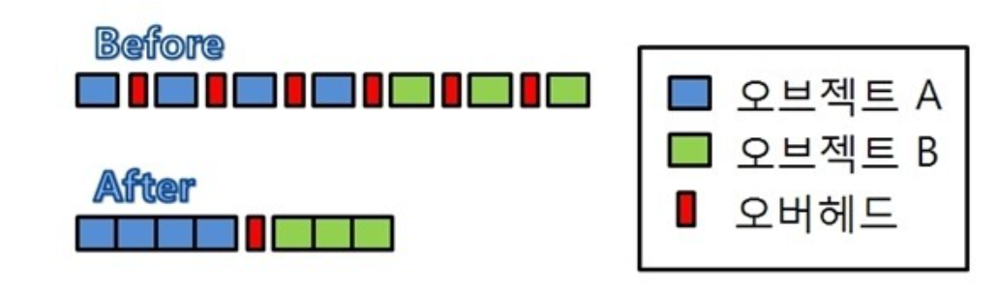

## 인스턴싱
하나의 오브젝트에 대한 여러개의 인스턴스를 1번의 DrawCall로 그리는 기법

여러번 DrawCall을 하지 않고 한번의 DrawCall로 여러개의 동일한 Mesh를 그리는 방식  
동일한 Mesh를 여러번 그리는 것이 아니라, 동일한 Mesh를 여러개 그리는 것이기 때문에,  
DrawCall이 1번만 발생하게 되어 성능이 향상된다.  

